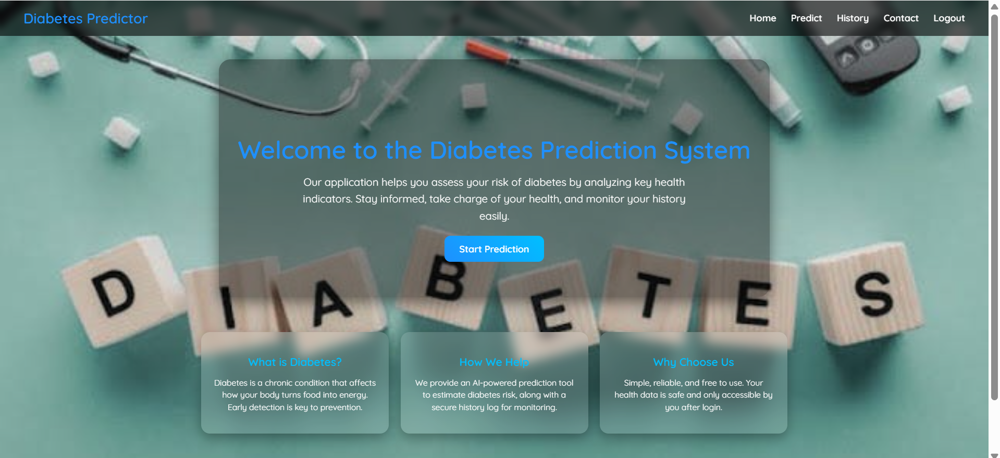
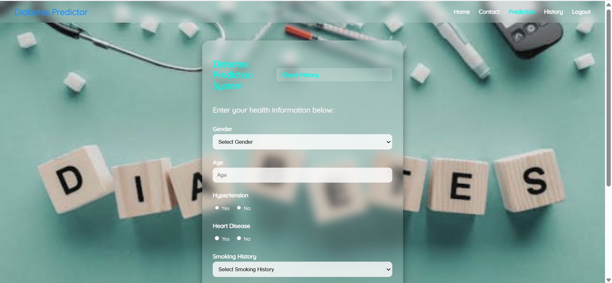
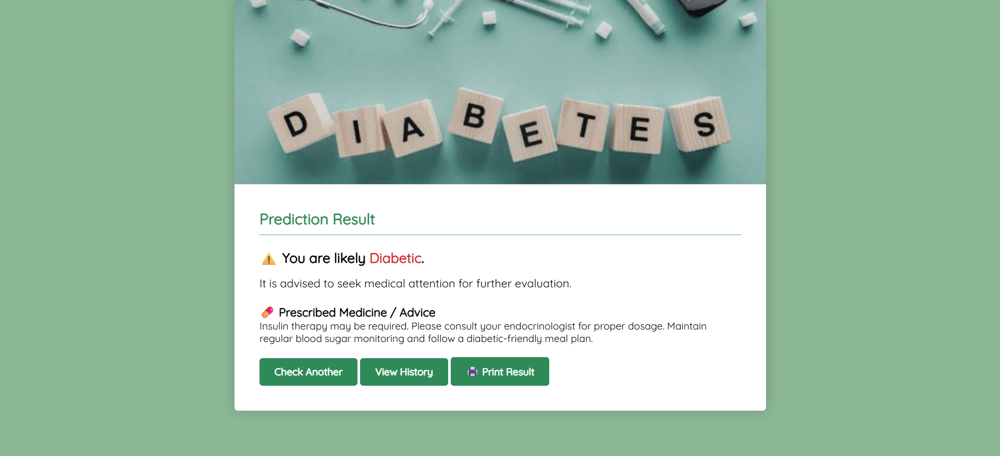
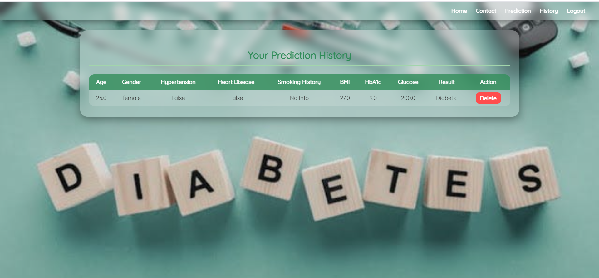
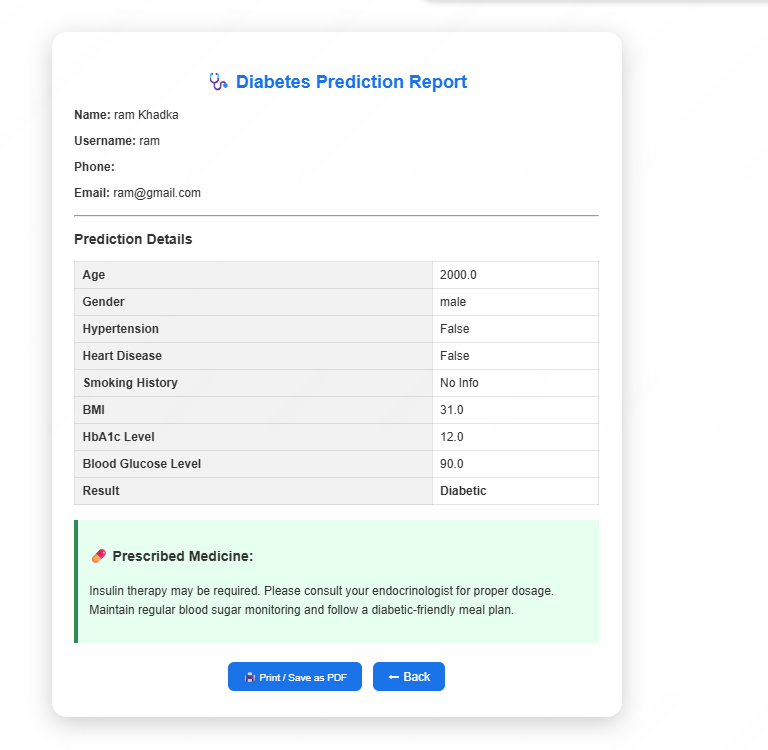

# Diabetes Prediction System

A web application to predict diabetes risk using XGBoost, built with Django for the backend and HTML/CSS for the frontend. Users can input health data, get predictions, track history, and print results. Admins can manage users and view prediction data.

---

## 🔹 Features

### User Features
- Sign up / Login
- Input health parameters:
  - Gender
  - Age
  - Hypertension
  - Heart Disease
  - Smoking History
  - BMI
  - HbA1c Level
  - Blood Glucose Level
- Predict diabetes risk using XGBoost
- View past prediction history
- Print prediction results

### Admin Features
- Admin login
- Manage users
- View users’ prediction history

---

## 💻 Technology Stack
- **Backend:** Django 
- **Database** sqlite3
- **Frontend:** HTML, CSS   
- **Machine Learning:** XGBoost, Pandas, NumPy, Scikit-learn, Matplotlib

---

## 🚀 Installation

```bash
# Clone the repository
git clone https://github.com/Aaryan012/Diabetes-Prediction-System.git
cd diabetes-prediction-system
```
## Screenshot








